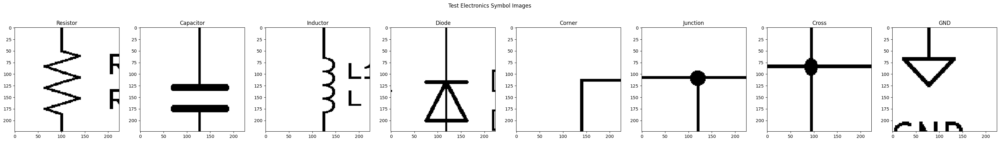

# SPICEnet
Convolutional neural network for recognition of electrical components on schematics.

## About
  
`SPICEnet` is a transfer-learnig model based on VGG16 which is able to classify the following electrical components:
- Resistor
- Capacitor
- Inductor
- Diode
- *Corner*
- *T-Junction*
- *Cross*
- Ground

This model is part of the [PNG2SPICE](https://github.com/jake-is-ESD-protected/png2spice) project, which needs information about the lines as well, which is why the classes *Corner*, *T-Junction* and *Cross* exist. We recommend checking out **PNG2SPICE** for moreinformation.

## Train it yourself
Download this repo, navigate to it and create a virtual environment:
```
python3 -m venv .env
```
Activate it:
```
source .env/bin/activate    # Linux
.env/Scripts/activate       # Windows
```
Install the requirements with
```
pip install -r requirements.txt
```

You can now add/remove data from the `img_src` folder, which holds a few instances of the listed components in the form of screenshots. You should adhere to the naming convention in order for the training process to go smoothly.

1. Add/remove data from `img_src`
2. Name the data like "**T_info_N**" where **T** is the type number (1 (Resistor) to 8 (Ground)) and **N** is the number of samples of that part. **info** can be whatever you want. For example, if you add two capacitor images, be sure to name one `2_mycap_1` and the other `2_mycap_2`.
3. Modify `SPICENET_PARAMS` in `SPICEnet.ipynb` to your liking (see the documentation in section "*SPICEnet parameters*")
4. Run the notebook. Tensorflow will utilize your GPU if you have it set up properly.
